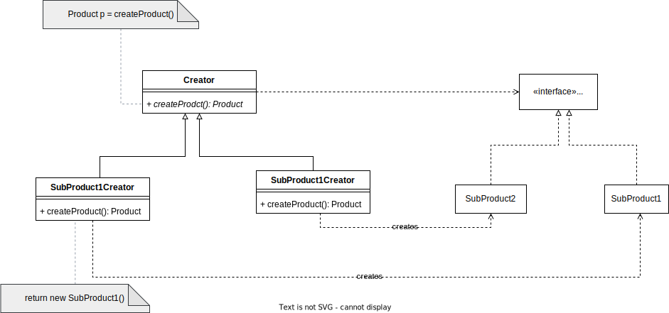

#Define
Provides interface method in parent class to create object, whereas subclass handles the specifics for the type of object creation

#Structure


#Example
https://github.com/tinasoni112/DesignPatterns/blob/b277b6bb9550df5a217d35dbce1049f2cbdaf465/src/examples/creational/factorymethod/product/Product.java#L1
```java

```

